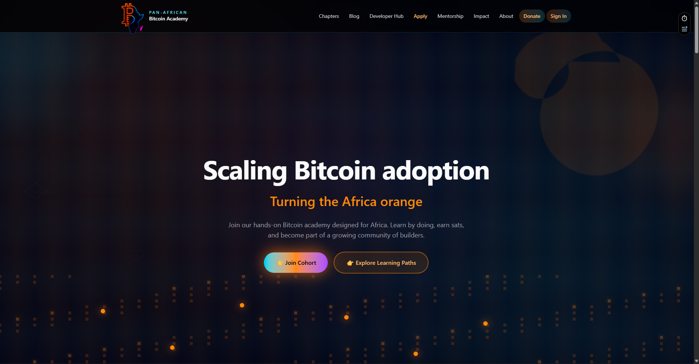
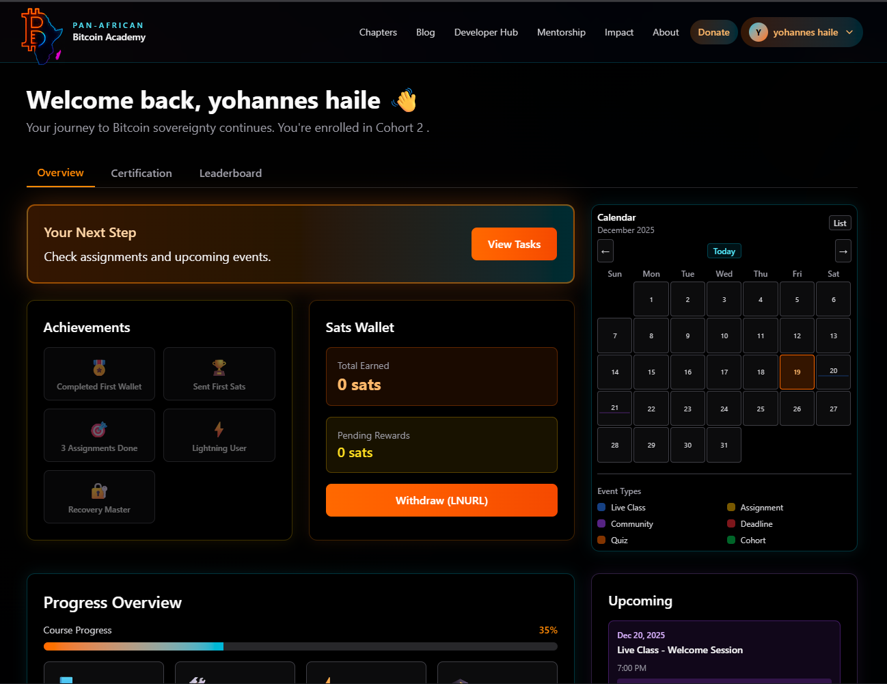
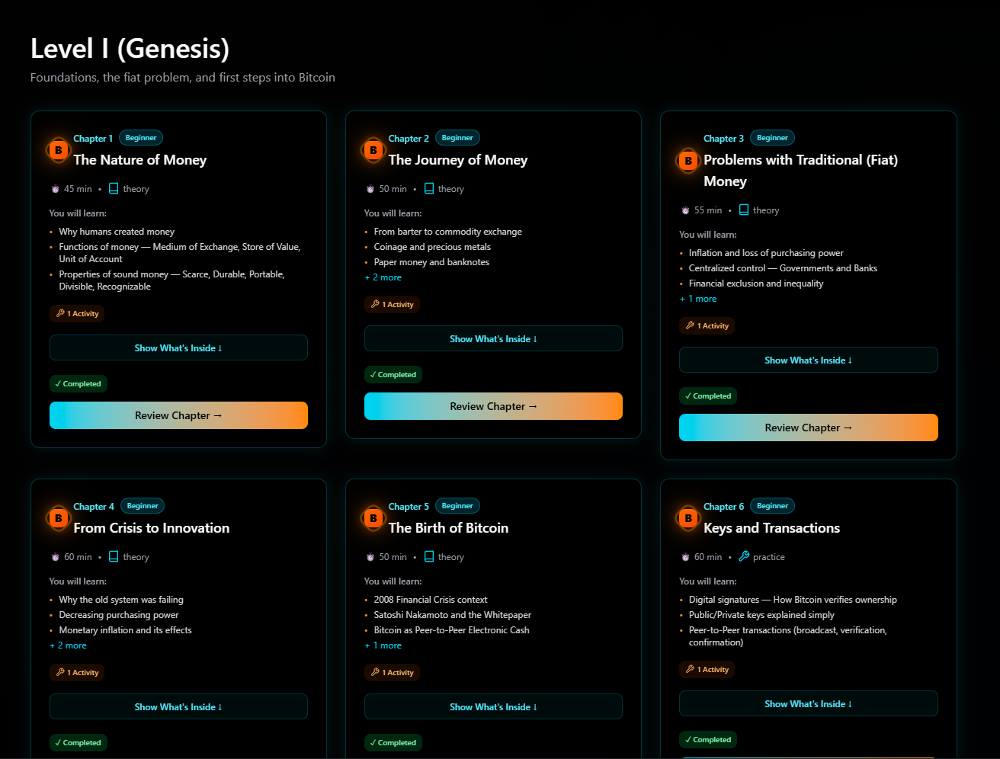

#              <div align="center"> Pan-Africa Bitcoin Academy </dev>

<div align="center">


**Empowering the next generation of African Bitcoin talent through education, mentorship, and community.**

[🌐 Live Website](https://panafricanbitcoin.com) • [📚 Course Materials](https://github.com/Joie199/pan-africa-bitcoin-academy/tree/main/content/courses/genesis) • [📖 Documentation](./STEP_BY_STEP_GUIDE.md) • [💬 Community](#community) • [🤝 Contribute](#contributing)

---

## 📚 Open Course Materials (CC-BY-SA-4.0)

**All course content is freely available in this repository!**

👉 **[Browse All Chapters →](https://github.com/Joie199/pan-africa-bitcoin-academy/tree/main/content/courses/genesis/chapters)**

### Quick Chapter Links

**Level I (Genesis)** - Foundations, the fiat problem, and first steps into Bitcoin
<br><center> [Chapter 1: The Nature of Money](https://github.com/Joie199/pan-africa-bitcoin-academy/blob/main/content/courses/genesis/chapters/ch01-nature-of-money.md)</center>
- [Chapter 2: The Journey of Money](https://github.com/Joie199/pan-africa-bitcoin-academy/blob/main/content/courses/genesis/chapters/ch02-journey-of-money.md)
- [Chapter 3: Problems with Traditional (Fiat) Money](https://github.com/Joie199/pan-africa-bitcoin-academy/blob/main/content/courses/genesis/chapters/ch03-fiat-problems.md)
- [Chapter 4: From Crisis to Innovation](https://github.com/Joie199/pan-africa-bitcoin-academy/blob/main/content/courses/genesis/chapters/ch04-crisis-to-innovation.md)
- [Chapter 5: The Birth of Bitcoin](https://github.com/Joie199/pan-africa-bitcoin-academy/blob/main/content/courses/genesis/chapters/ch05-birth-of-bitcoin.md)
- [Chapter 6: Keys and Transactions](https://github.com/Joie199/pan-africa-bitcoin-academy/blob/main/content/courses/genesis/chapters/ch06-keys-and-transactions.md)
- [Chapter 7: Blockchain Basics](https://github.com/Joie199/pan-africa-bitcoin-academy/blob/main/content/courses/genesis/chapters/ch07-blockchain-basics.md)
- [Chapter 8: Exchange & Software Wallet](https://github.com/Joie199/pan-africa-bitcoin-academy/blob/main/content/courses/genesis/chapters/ch08-exchange-and-wallet.md)

**Level II (Difficulty-Adjustment 1)**
- [Chapter 9: UTXOs, Fees & Coin Control](https://github.com/Joie199/pan-africa-bitcoin-academy/blob/main/content/courses/genesis/chapters/ch09-utxos-fees.md)
- [Chapter 10: Good Bitcoin Hygiene](https://github.com/Joie199/pan-africa-bitcoin-academy/blob/main/content/courses/genesis/chapters/ch10-hygiene.md)
- [Chapter 11: Hardware Signers](https://github.com/Joie199/pan-africa-bitcoin-academy/blob/main/content/courses/genesis/chapters/ch11-hardware-signers.md)
- [Chapter 12: Layer 2 & Sidechains](https://github.com/Joie199/pan-africa-bitcoin-academy/blob/main/content/courses/genesis/chapters/ch12-layer2-sidechains.md)
- [Chapter 13: Verify for Yourself — Block Explorers & Nodes](https://github.com/Joie199/pan-africa-bitcoin-academy/blob/main/content/courses/genesis/chapters/ch13-verify.md)
- [Chapter 14: Proof of Work and Block Rewards](https://github.com/Joie199/pan-africa-bitcoin-academy/blob/main/content/courses/genesis/chapters/ch14-pow-rewards.md)
- [Chapter 15: Mining in Practice](https://github.com/Joie199/pan-africa-bitcoin-academy/blob/main/content/courses/genesis/chapters/ch15-mining-practice.md)

**Level III (Advanced Sovereignty)**
- [Chapter 16: Full Node & Opening a Lightning Channel](https://github.com/Joie199/pan-africa-bitcoin-academy/blob/main/content/courses/genesis/chapters/ch16-full-node-lightning.md)
- [Chapter 17: Multi-Sig (Collaborative Custody)](https://github.com/Joie199/pan-africa-bitcoin-academy/blob/main/content/courses/genesis/chapters/ch17-multisig.md)
- [Chapter 18: Intro to Bitcoin Script](https://github.com/Joie199/pan-africa-bitcoin-academy/blob/main/content/courses/genesis/chapters/ch18-bitcoin-script.md)
- [Chapter 19: UTXO Consolidation & Privacy Risks](https://github.com/Joie199/pan-africa-bitcoin-academy/blob/main/content/courses/genesis/chapters/ch19-consolidation-privacy.md)
- [Chapter 20: Why Bitcoin? Philosophy & Adoption](https://github.com/Joie199/pan-africa-bitcoin-academy/blob/main/content/courses/genesis/chapters/ch20-philosophy.md)
- [Chapter 21: Wrap-Up & Resources](https://github.com/Joie199/pan-africa-bitcoin-academy/blob/main/content/courses/genesis/chapters/ch21-wrap-up.md)

📖 **[View Full Course Overview →](https://github.com/Joie199/pan-africa-bitcoin-academy/blob/main/content/courses/genesis/README.md)**

</div>

---

## 📸 Project Screenshots

<!-- Add screenshots here when available -->
<div align="center">


*Home page with Bitcoin-themed visuals and community links*


*Student dashboard with progress tracking and achievements*


*Interactive learning chapters with progress indicators*

</div>

---

## 🎯 Overview

A modern, comprehensive Bitcoin education platform designed specifically for African students. The Pan-Africa Bitcoin Academy provides structured learning paths, interactive content, gamified progress tracking, and community support to help students master Bitcoin from basics to advanced topics.

### 🌟 Key Highlights

- **21 Comprehensive Chapters** - From "The Nature of Money" to "Why Bitcoin? Philosophy & Adoption"
- **Interactive Learning** - Progress tracking, achievements, sats rewards, and gamification
- **Community-Driven** - Mentorship programs, cohort-based learning, and peer support
- **Bitcoin-First** - Lightning Network donations, sats-based rewards, and Bitcoin-native features
- **Africa-Focused** - Designed for African students with local context and examples

---

## ✨ Features

### 📚 Learning System
- **20 Structured Chapters** - Complete Bitcoin education curriculum
  - Beginner: Nature of Money, What is Bitcoin, Keys & Addresses, Wallets
  - Intermediate: UTXO Model, Bitcoin Hygiene, Hardware Signers, Layer 2
  - Advanced: Full Nodes, Lightning Channels, Multi-Sig, Bitcoin Script
- **Progress Tracking** - Visual progress indicators, completion status, and learning paths
- **Interactive Content** - Notes, tips, warnings, examples, and image placeholders
- **Key Terms Glossary** - Clickable terms that link to definitions within chapters

### 🎮 Gamification
- **Achievements System** - Unlockable badges and rewards
- **Sats Wallet** - Earn and track sats for completing activities
- **Leaderboard** - Rankings based on sats earned and progress
- **Progress Dashboard** - Course completion, chapters completed, assignments done

### 📅 Calendar & Events
- **Interactive Calendar** - Month and list views with color-coded events
- **Event Types** - Live classes, assignments, deadlines, quizzes
- **Google Calendar Integration** - Sync events to personal calendars
- **Cohort Sessions** - Track scheduled learning sessions

### 👥 Community Features
- **Cohort System** - Join cohorts with other students at your level
- **Mentorship Program** - Apply to become a mentor or get mentored
- **Community Links** - WhatsApp, Nostr, Discord integration
- **Blog** - "Voices of the Pan-Africa Bitcoin Academy" - student and mentor stories

### 💰 Bitcoin Integration
- **Lightning Network** - Fast, low-fee payments
- **On-Chain Donations** - Support the academy with Bitcoin
- **Sats Rewards** - Earn sats for learning and participation
- **Bitcoin Wallet Integration** - Track your Bitcoin holdings

### 🔐 Authentication & Profiles
- **Secure Authentication** - Supabase-based auth system
- **Profile Management** - Edit profile, upload pictures, manage settings
- **Student Dashboard** - Personalized learning experience
- **Progress Sync** - Real-time progress tracking across devices

---

## 📖 Chapter Content

The academy includes **20 comprehensive chapters** covering:

1. **The Nature of Money** - Understanding money, inflation, and Bitcoin's role
2. **What is Bitcoin?** - Introduction to Bitcoin, blockchain, and decentralization
3. **Keys & Addresses** - Public/private keys, addresses, and security
4. **Wallets** - Types of wallets, seed phrases, and best practices
5. **Exchanges** - How to buy Bitcoin, KYC, and security
6. **Your First Transaction** - Sending and receiving Bitcoin safely
7. **Bitcoin Hygiene** - Privacy, security, and best practices
8. **UTXO Model** - Understanding Bitcoin's transaction model
9. **Good Bitcoin Hygiene** - Address reuse, labeling, and privacy habits
10. **Hardware Signers** - Hardware wallets, PSBT, and cold storage
11. **Layer 2 & Sidechains** - Lightning Network and scaling solutions
12. **Verify - Block Explorers & Nodes** - Independent verification
13. **Proof of Work** - Mining, block rewards, and security
14. **Mining in Practice** - Difficulty, pools, and economics
15. **Full Node & Lightning** - Running your own node and channels
16. **Multi-Sig** - Collaborative custody and security
17. **Bitcoin Script** - Understanding Bitcoin's programming language
18. **UTXO Consolidation** - Privacy risks and best practices
19. **Why Bitcoin?** - Philosophy, adoption, and impact

Each chapter includes:
- ✅ Detailed explanations (not summaries)
- 📝 Notes, tips, warnings, and examples
- 🖼️ Image placeholders for visual learning
- 🎯 Key terms with clickable links
- 📋 Activities and exercises
- 📊 Summary and takeaways

---

## 🛠️ Tech Stack

### Frontend
- **Next.js 16** - React framework with App Router
- **TypeScript** - Type-safe development
- **Tailwind CSS 4** - Utility-first CSS framework
- **React 19** - Latest React features

### Backend & Database
- **Supabase** - PostgreSQL database with real-time capabilities
- **Supabase Auth** - Authentication and user management
- **Supabase Storage** - File uploads and media storage

### Deployment
- **Vercel** - Hosting and deployment platform
- **Custom Domain** - panafricanbitcoin.com

### Bitcoin Integration
- **Lightning Network** - Fast payments
- **Bitcoin Core** - Full node support
- **Wallet Integration** - Multiple wallet support

---

## 🚀 Getting Started

### Prerequisites

- Node.js 18+ and npm
- Git
- Supabase account (for database)

### Installation

1. **Clone the repository**
   ```bash
   git clone https://github.com/Joie199/pan-africa-bitcoin-academy.git
   cd pan-africa-bitcoin-academy
   ```

2. **Install dependencies**
```bash
npm install
```

3. **Set up environment variables**

   Create a `.env.local` file:
```env
# Site Configuration
NEXT_PUBLIC_SITE_URL=https://panafricanbitcoin.com

   # Supabase Configuration
NEXT_PUBLIC_SUPABASE_URL=your_supabase_project_url
NEXT_PUBLIC_SUPABASE_ANON_KEY=your_supabase_anon_key
SUPABASE_SERVICE_ROLE_KEY=your_service_role_key
```

4. **Set up the database**
   
   Run the SQL schema in Supabase SQL Editor:
   - See `supabase/schema.sql` for the complete schema
   - Optional: Add sample data with `supabase/sample-data.sql`

5. **Run the development server**
```bash
npm run dev
```

6. **Open your browser**
   
   Navigate to [http://localhost:3000](http://localhost:3000)

### 📚 Documentation

- [Supabase Setup Guide](./SUPABASE_SETUP.md) - Database setup instructions
- [Step-by-Step Guide](./STEP_BY_STEP_GUIDE.md) - Complete implementation guide
- [Testing Checklist](./TESTING_CHECKLIST.md) - Testing procedures
- [Deployment Guide](./DEPLOYMENT_STATUS.md) - Deployment information
- [SEO Optimization](./SEO_OPTIMIZATION.md) - SEO setup and best practices

---

## 📁 Project Structure

```
pan-africa-bitcoin-academy/
├── src/
│   ├── app/                    # Next.js App Router pages
│   │   ├── page.tsx            # Home page
│   │   ├── dashboard/          # Student dashboard
│   │   ├── chapters/           # Learning chapters (20 chapters)
│   │   │   ├── page.tsx        # Chapters listing
│   │   │   └── [slug]/         # Individual chapter pages
│   │   ├── apply/              # Cohort registration
│   │   ├── developer-hub/      # Developer resources
│   │   ├── donate/             # Bitcoin donations
│   │   ├── faq/                # FAQ page
│   │   ├── impact/             # Impact dashboard
│   │   ├── mentorship/         # Mentorship program
│   │   └── blog/               # Blog system
│   ├── components/             # React components
│   │   ├── Navbar.tsx          # Navigation header
│   │   ├── Footer.tsx          # Footer component
│   │   ├── AuthModal.tsx       # Authentication modal
│   │   ├── StudentDashboard.tsx # Main dashboard
│   │   ├── Calendar.tsx        # Interactive calendar
│   │   └── PageContainer.tsx   # Page layout wrapper
│   ├── content/                 # Content files
│   │   └── chaptersContent.ts  # All 20 chapters content
│   ├── lib/                     # Utility libraries
│   │   └── supabase.ts         # Supabase client
│   └── hooks/                   # React hooks
│       └── useAuth.ts           # Authentication hook
├── public/                      # Static assets
│   └── images/                  # Images and screenshots
├── supabase/                    # Database files
│   ├── schema.sql              # Database schema
│   └── sample-data.sql         # Sample data
└── README.md                   # This file
```

---

## 🎨 Design & Theme

The platform features a **futuristic Bitcoin-themed design**:

- **Color Palette**
- Deep blue backgrounds (`#02000a`)
- Orange accents (`#f97602`)
- Cyan and purple highlights
- Glowing neon-style elements

- **Visual Elements**
  - Bitcoin network-inspired backgrounds
  - Blockchain visualization effects
  - Key and lock iconography
  - Modern, clean UI with smooth animations

---

## 🌍 Deployment

### Production URLs

- **Live Website**: [https://panafricanbitcoin.com](https://panafricanbitcoin.com)
- **Vercel Dashboard**: [Vercel Project](https://vercel.com/yohannes-projects-586fef0b/pan-africa-bitcoin-academy)

### Deployment Features

- ✅ Automatic deployments from GitHub
- ✅ Supabase integration via Vercel
- ✅ Custom domain configuration
- ✅ SSL/HTTPS enabled
- ✅ Performance optimizations
- ✅ SEO optimization

---

## 🤝 Contributing

We welcome contributions! This project is part of a broader effort to build Bitcoin education and sovereignty in Africa.

### How to Contribute

1. **Fork the repository**
2. **Create a feature branch** (`git checkout -b feature/amazing-feature`)
3. **Make your changes**
4. **Commit your changes** (`git commit -m 'Add some amazing feature'`)
5. **Push to the branch** (`git push origin feature/amazing-feature`)
6. **Open a Pull Request**

### Contribution Areas

- 📝 Content improvements (chapters, examples, translations)
- 🐛 Bug fixes and improvements
- 🎨 UI/UX enhancements
- 📚 Documentation updates
- 🌍 Localization (African languages)
- 🧪 Testing and quality assurance

---

## 📊 Project Status

### ✅ Completed Features

- [x] 20 comprehensive learning chapters
- [x] Student dashboard with progress tracking
- [x] Interactive calendar system
- [x] Authentication and profile management
- [x] Gamification (achievements, sats, leaderboard)
- [x] Cohort registration and management
- [x] Blog system
- [x] Bitcoin donations (Lightning + on-chain)
- [x] Mentorship program
- [x] Developer hub
- [x] SEO optimization
- [x] Mobile responsive design

### 🚧 In Progress

- [ ] Additional chapter content expansion
- [ ] More interactive exercises
- [ ] Enhanced analytics
- [ ] Mobile app development

### 📋 Planned Features

- [ ] Multi-language support
- [ ] Video content integration
- [ ] Live streaming for classes
- [ ] Advanced certificate system
- [ ] Community forums
- [ ] Mobile app (iOS/Android)

---

## 📞 Community

Join our community:

- **WhatsApp** - [Join Group](#) (link to be added)
- **Nostr** - [Follow Us](#) (link to be added)
- **Discord** - [Join Server](#) (link to be added)
- **Email** - Contact via [About page](/about)

---

## 📄 License

This program is free software: you can redistribute it and/or modify it under the terms of the [GNU General Public License v3](https://www.gnu.org/licenses/gpl-3.0.html) or (at your option) any later version.

This program is distributed in the hope that it will be useful, but WITHOUT ANY WARRANTY; without even the implied warranty of MERCHANTABILITY or FITNESS FOR A PARTICULAR PURPOSE. See the [GNU General Public License](https://www.gnu.org/licenses/gpl-3.0.html) for more details.

You should have received a copy of the GNU General Public License along with this program. If not, see <https://www.gnu.org/licenses/>.

**Educational content - use responsibly. Not financial advice.**

This project is open source and available for educational purposes. Please use responsibly and do not consider this as financial advice.

---

## 🙏 Acknowledgments

- Bitcoin community for inspiration and support
- African Bitcoin developers and educators
- Open source contributors
- All students and mentors of the Pan-Africa Bitcoin Academy

---

## 📈 Impact

The Pan-Africa Bitcoin Academy aims to:

- 🎓 Educate thousands of African students about Bitcoin
- 💡 Build a strong Bitcoin developer community in Africa
- 🌍 Promote financial sovereignty across the continent
- 🤝 Create mentorship opportunities
- 📚 Provide free, high-quality Bitcoin education

---

<div align="center">

**Built with ❤️ for the Bitcoin community in Africa**

[⬆ Back to Top](#-pan-africa-bitcoin-academy)

</div>
